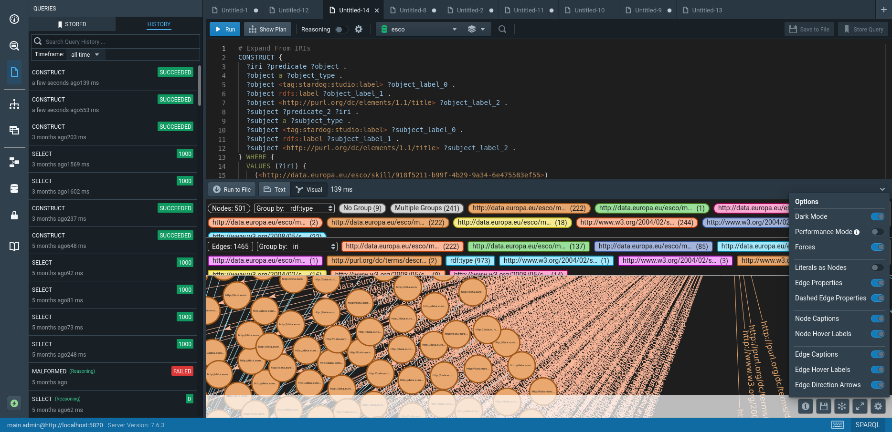

# Hyperfolio - Cloud Services

Some of the main services cloud-side used by the Hyperfolio apps:
- Rancher (K8s absctaction layer)
- Django microsservices
- Stardog (Graph database for exposing the ESCO dataset)
- CockroachDB (Distributed SQL database integrated on the K8s)

Screenshots:
Stardog UI endpoint with the ESCO dataset loaded: 

